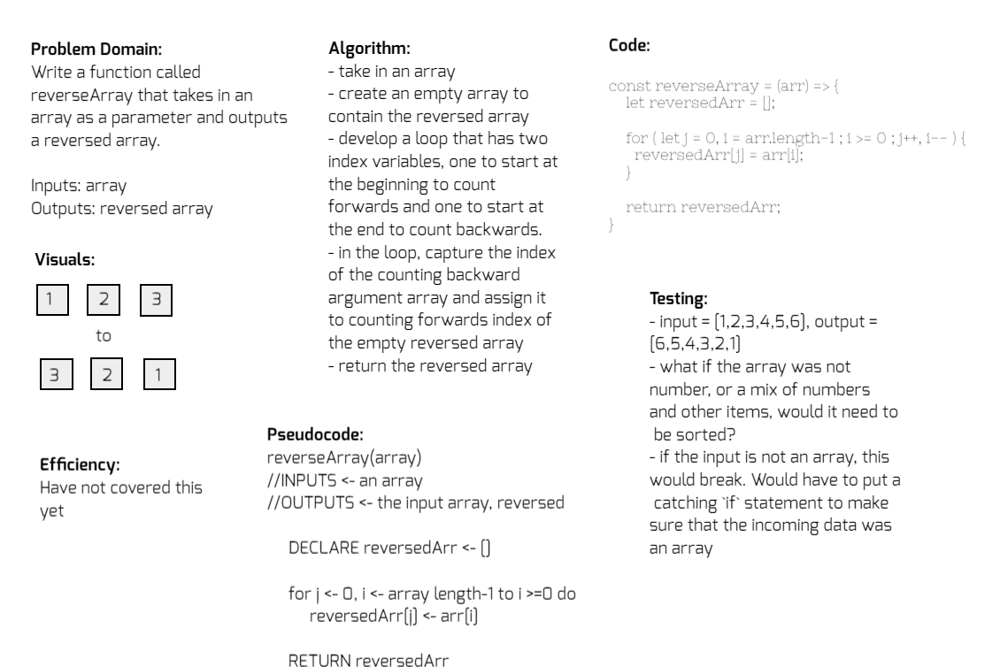
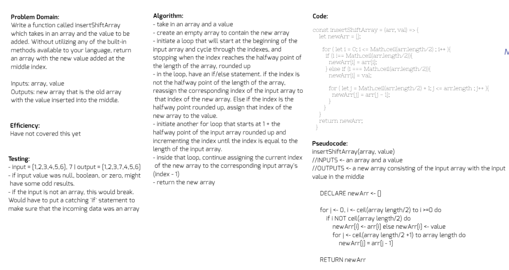
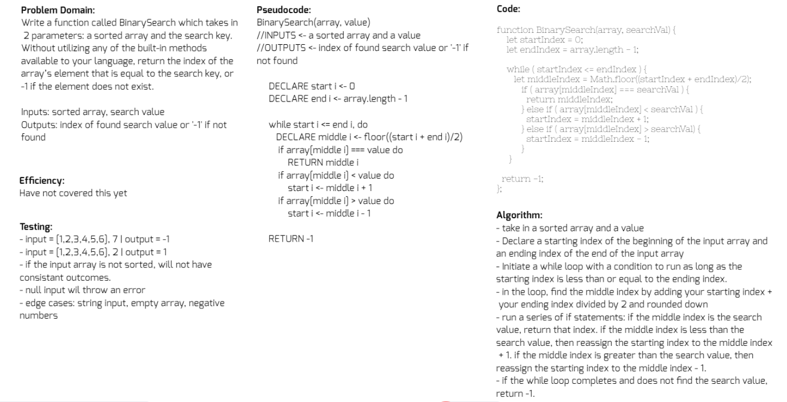

# Data Structures and Algorithms
Code Fellows 301n16 & 401n16

## 301 Code Challenges
- [Array forEach](./code-challenges/for-each/challenges/challenges-01.test.js)
- [Pass by Reference](./code-challenges/value-vs-reference/challenges-02.test.js)
- [Sort](./code-challenges/sort/challenges-03.test.js)
- [Regular Expressions Pt. 1](./code-challenges/regular_expressions_pt1/challenges-04.test.js)
- [Split, Join, Slice, Splice](./code-challenges/split-join-slice-splice/challenges-05.test.js)
- [Object Iteration](./code-challenges/objects/challenges-06.test.js)
- [Map](./code-challenges/map/challenges-07.test.js)
- [Filter](./code-challenges/filter/challenges-08.test.js)
- [Reduce](./code-challenges/reduce/challenges-09.test.js)
- [Chaining](./code-challenges/chaining/challenges-10.test.js)
- [Regular Expressions Pt. 2](./code-challenges/regular_expressions_pt2/challenges-11.test.js)
- [Two-Dimensional Arrays](./code-challenges/two_dimensional_arrays/challenges-12.test.js)
- [String Manipulation](./code-challenges/string_manipulation/challenges-13.test.js)
- [All Methods](./code-challenges/allMethods/challenges-14.test.js)

## 401 Data Structure Challenges
### [Linked List README.md](./data-structures/linkedList/README.md)

## 401 Code Challenges

### [Reverse an Array](./challenges/arrayReverse/array-reverse.js)
  - **Challenge**: Write a function called reverseArray which takes an array as an argument. Without utilizing any of the built-in methods available to your language, return an array with elements in reversed order.
  - **Approach & Efficiency**: The challenge to not use array methods was really difficult. I wanted so badly just to use `.push()`. I started my approach by thinking about what values I needed to capture and where those values needed to go. I knew I would need to loop over the original array. The decision I had to make was either to make a new array or to modify the array in-place. I decided to create a new array so that the original array could still be used elsewhere if needed. [This article](https://medium.com/@josephcardillo/how-to-reverse-arrays-in-javascript-without-using-reverse-ae995904efbe) helped me with theory and [this entry](https://stackoverflow.com/questions/50999847/reverse-array-with-for-loops) helped me syntatically. I didn't know you could do so much within the parameters of a `for` loop until I read over those responses. I don't know anything about efficiency yet.
  - **Solution**: 

### [Insert and shift an array in middle at index](./challenges/arrayShift/array-shift.js)
  - **Challenge**: Write a function called insertShiftArray which takes in an array and the value to be added. Without utilizing any of the built-in methods available to your language, return an array with the new value added at the middle index.
  - **Approach & Efficiency**: I first thought about how I could access the precise middle of an array without splice on any sized array. I thought this could be done with `array.length` and then divide it by two. To account for odd numbered input arrays, I decided to round the halfway point up to the nearest whole number with `Math.ceil()`, because that was how the example outputs displayed this. I know there are more elegant ways of solving this problem, and I would love to see those!
  - **Solution**:   

### [Binary search in a sorted 1D array](./challenges/arrayBinarySearch/array-binary-search.js)
- **Challenge**: Write a function called BinarySearch which takes in 2 parameters: a sorted array and the search key. Without utilizing any of the built-in methods available to your language, return the index of the array’s element that is equal to the search key, or -1 if the element does not exist.
- **Approach & Efficiency**: The article [Binary Search Algorithm](https://en.wikipedia.org/wiki/Binary_search_algorithm) on Wikipedia helped me conceptualize the problem and [this article on Medium](https://medium.com/@jeffrey.allen.lewis/javascript-algorithms-explained-binary-search-25064b896470) gave me a more detailed explaination of what is actually happening in a binary search. I'd never heard of this method before this code challenge. I knew that I had to use a `while` loop, since a `for` loop would hit every item in succession instead of picking out the middle. I also knew that I would have to capture the moving middle index and also have some way of moving either the "starting" or "ending" points in the search field. I also knew I would would have to check with `if` statements on which direction to move the goal posts. The articles I linked helped me tie together those thoughts syntatically.
- **Solution**: 