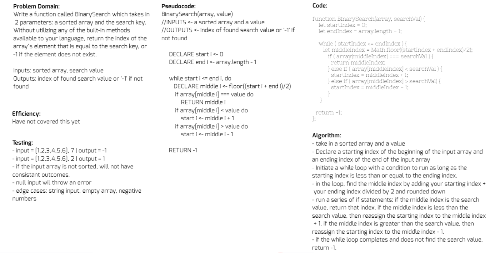

# Binary search in a sorted 1D array

## Challenge
Write a function called BinarySearch which takes in 2 parameters: a sorted array and the search key. Without utilizing any of the built-in methods available to your language, return the index of the array’s element that is equal to the search key, or -1 if the element does not exist.

## Approach & Efficiency
The article [Binary Search Algorithm](https://en.wikipedia.org/wiki/Binary_search_algorithm) on Wikipedia helped me conceptualize the problem and [this article on Medium](https://medium.com/@jeffrey.allen.lewis/javascript-algorithms-explained-binary-search-25064b896470) gave me a more detailed explaination of what is actually happening in a binary search. I'd never heard of this method before this code challenge. I knew that I had to use a `while` loop, since a `for` loop would hit every item in succession instead of picking out the middle. I also knew that I would have to capture the moving middle index and also have some way of moving either the "starting" or "ending" points in the search field. I also knew I would would have to check with `if` statements on which direction to move the goal posts. The articles I linked helped me tie together those thoughts syntatically.

## Solution
