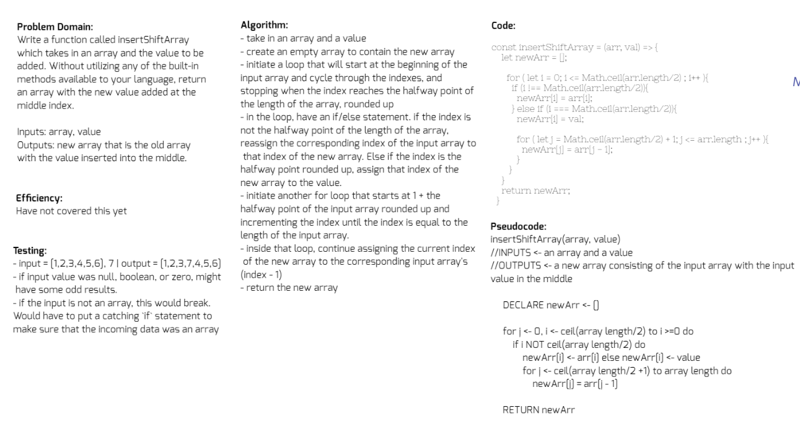

# Insert and shift an array in middle at index

## Challenge
Write a function called insertShiftArray which takes in an array and the value to be added. Without utilizing any of the built-in methods available to your language, return an array with the new value added at the middle index.

## Approach & Efficiency
I first thought about how I could access the precise middle of an array without splice on any sized array. I thought this could be done with `array.length` and then divide it by two. To account for odd numbered input arrays, I decided to round the halfway point up to the nearest whole number with `Math.ceil()`, because that was how the example outputs displayed this. I know there are more elegant ways of solving this problem, and I would love to see those!

## Solution
