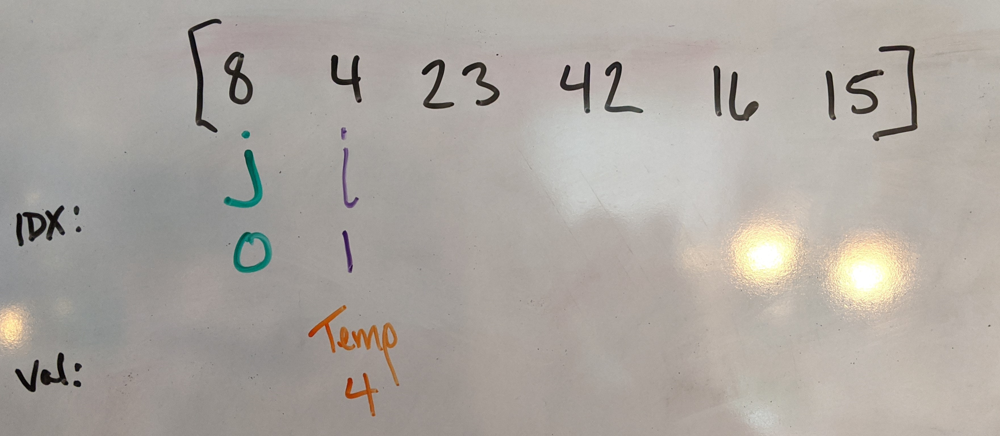
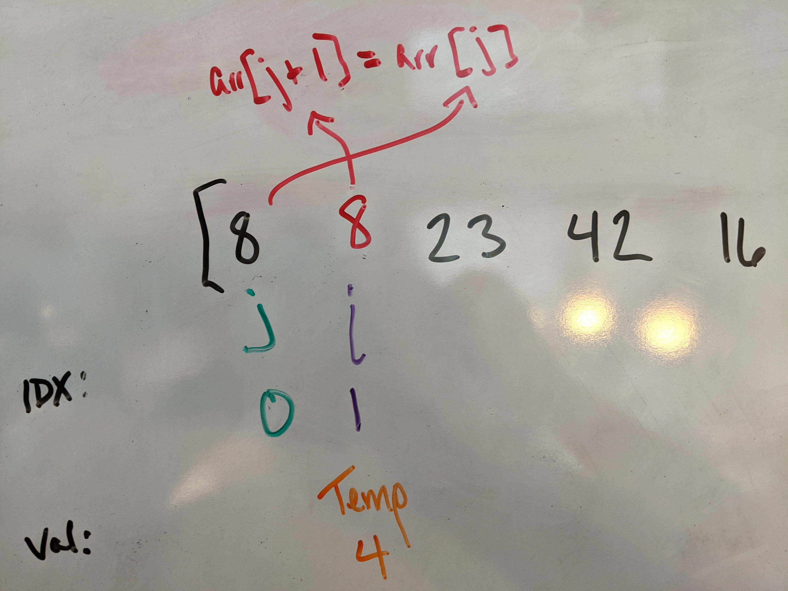
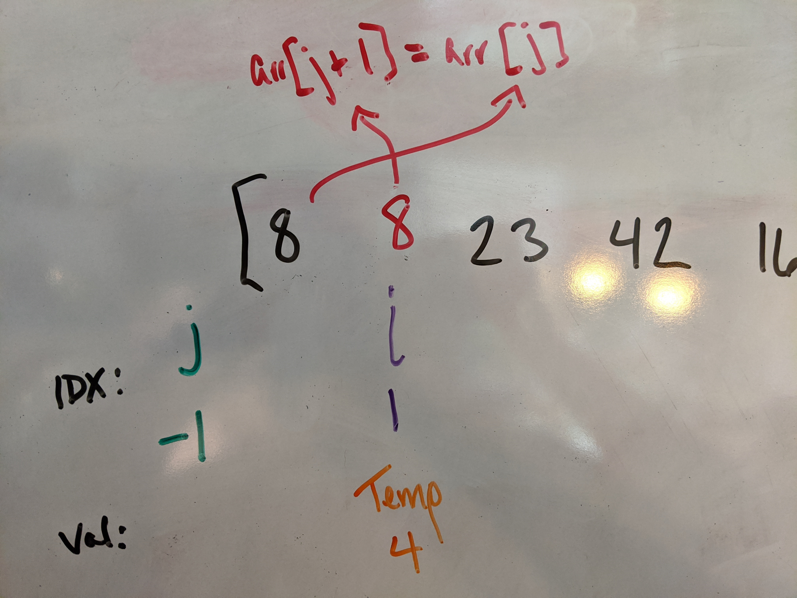
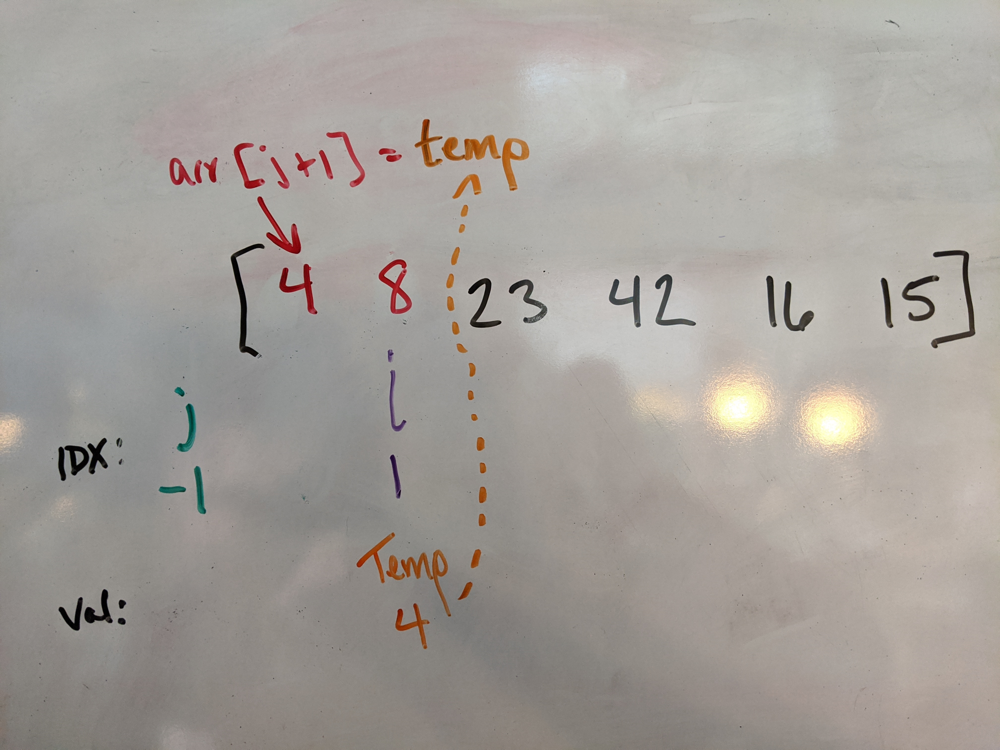

# Insertion Sort

> Review the pseudocode below, then trace the algorithm by stepping through the process with the provided sample array. Document your explanation by creating a blog article.

"Insertion Sort" is a function that takes in an array of integers and, like the name suggests, sorts the integers in place.

## Pseudocode
```
  InsertionSort(int[] arr)
  
    FOR i = 1 to arr.length
    
      int j <-- i - 1
      int temp <-- arr[i]
      
      WHILE j >= 0 AND temp < arr[j]
        arr[j + 1] <-- arr[j]
        j <-- j - 1
        
      arr[j + 1] <-- temp
```

## Walkthrough
#### Example Array: [8,4,23,42,16,15]

In our first iteration, indexes are assigned as `i` and `j`. where `i` starts at index `1` and `j` starts at index `0`. We also assign a third "holder" variable, `temp`, as the value at index `i` (which is `4` at the beginning.).



Once the variables are assigned, then we check against the `while` loop conditions: is `j >= 0 && temp < arr[j]`? In this first iteration, this represents the question: "Is 0 >= 0 _and_ 4 < 8?". This **is true**, so we enter the while loop.

Once we're inside of the while loop, we begin to do an interesting shuffle to rearrange and _sort_ the values. Our first order of business is to _reassign the value of the array at `j + 1` to the current value of the array at `j`_. This now changes the array to `[8, 8, 23, 42, 16, 15]`. 



Once the value of the array at `j + 1` is set, then we can increment `j` downward (`j = j - 1`) for the next `while` loop condition check. This time around, the check fails on the first part of the condition because `j` is now equal to `-1` and `-1 >= 0` is false.



So now, we break out of the `while` loop and make one more adjustment before going back to the beginning of our initial `for` loop. We are going to reassign the array at `j + 1` as the captured `temp` value, which is value that was initially at position `i`. At the end of this first `for` loop, the array now reads `[4, 8, 23, 42, 16, 15]`.



This process continues until the entire array is sorted!