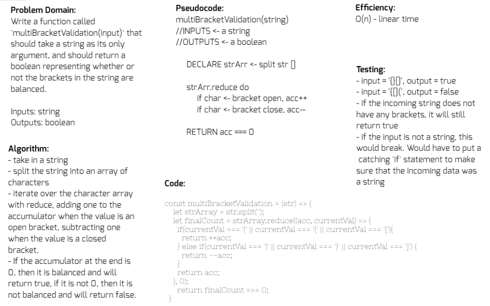

# Multi-Bracket Validation

## Challenge
Write a function called `multiBracketValidation(input)` that should take a string as its only argument, and should return a boolean representing whether or not the brackets in the string are balanced. There are 3 types of brackets:
  - Round Brackets : `()`
  - Square Brackets : `[]`
  - Curly Brackets : `{}`

## Approach & Efficiency
I had to do a lot of research with this one. [This article](https://medium.com/@paulrohan/parenthesis-matching-problem-in-javascript-the-hacking-school-hyd-7d7708278911) on Medium and [this article](https://js-algorithms.tutorialhorizon.com/2015/11/16/justify-if-a-string-consists-of-valid-parentheses/) on TutorialHorizon helped me to better understand the requirements of this problem. I knew that I would have to have some if statements and retain some sort of record of the brackets of the input string. There were a couple ideas that came to mind. I could see this working by creating a "bracket array" and pushing into that the brackets of the input string, kind of like how a stack works. In the end I decided to use the `.reduce()` method. I brushed up on `.reduce()` by checking out the [MDN docs](https://developer.mozilla.org/en-US/docs/Web/JavaScript/Reference/Global_Objects/Array/reduce). The efficiency should be O(n), or linear time.

## Solution
